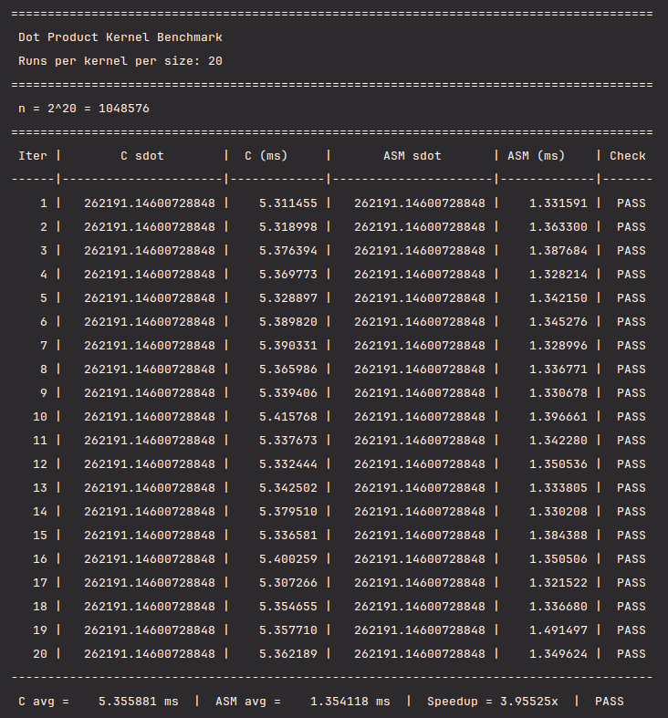
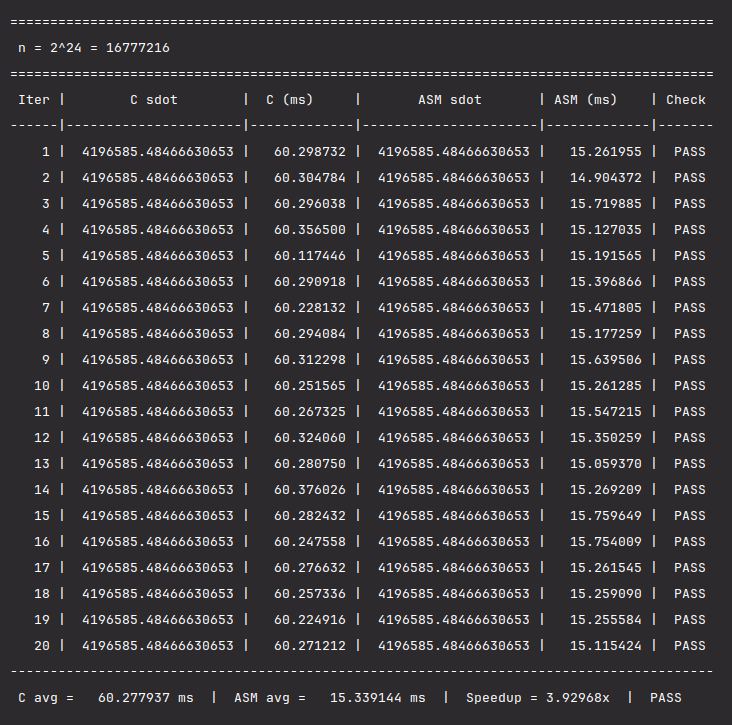
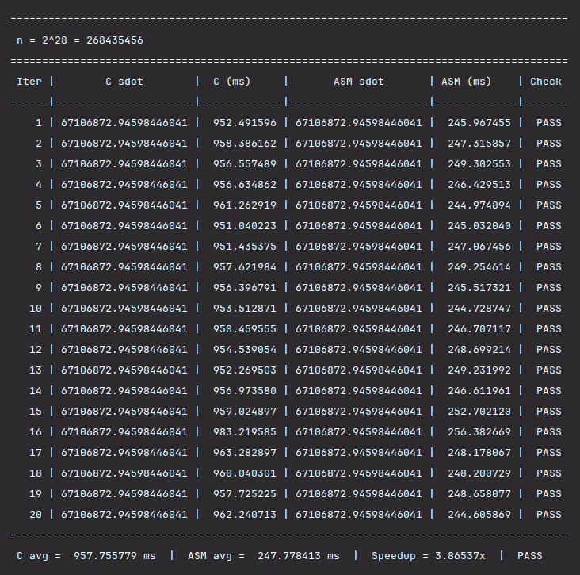
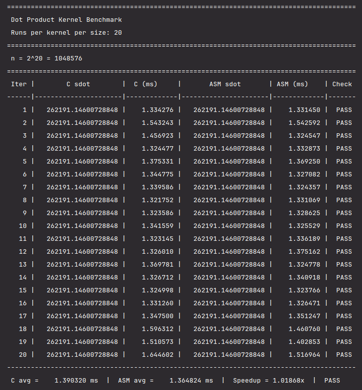
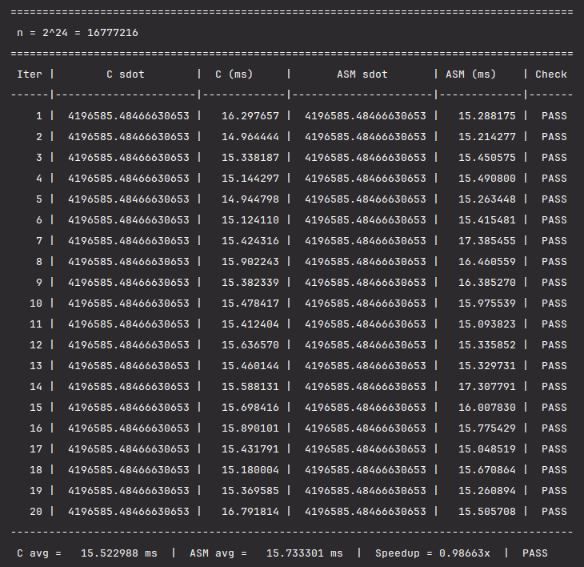
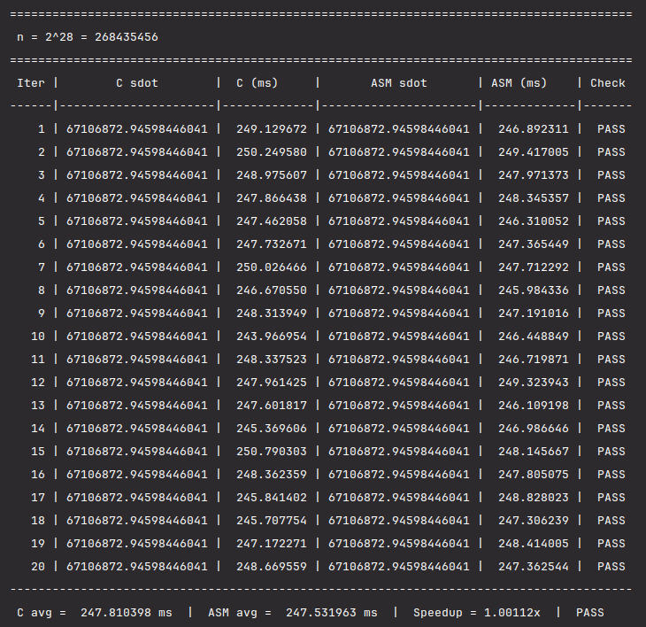

# Dot Product Kernel — C vs x86-64

By: John Lorens Tee (S25F)

Computes `sdot = Σ A[i]·B[i]` two ways, a plain C loop and a x86-64 assembly kernel, 
and compares their execution time and correctness.

```
sdot = a1*b1 + a2*b2 + ... + an*bn
```

## 1. Building

### CMake / CLion

```bash
cmake -S . -B build-debug   -DCMAKE_BUILD_TYPE=Debug   && cmake --build build-debug
cmake -S . -B build-release -DCMAKE_BUILD_TYPE=Release && cmake --build build-release
```
Opening the folder directly in CLion also works, it sees `CMakeLists.txt` automatically 
and lets you switch Debug/Release from the configuration dropdown.

**Requirements:** `gcc`, `nasm`.

## 2. Passing Parameters

```c
void dot_product_c(int n, double *A, double *B, double *sdot);
void dot_product_asm(int n, double *A, double *B, double *sdot);
```
`n` in `EDI`, `A` in `RSI`,`B` in `RDX`, and `sdot` in `RCX`.
These four registers are all caller-saved, so the assembly kernel just uses them directly,
no need to push/pop anything.

## 3. What the program does

For each vector size `n` (2<sup>20</sup>, 2<sup>24</sup>, and 2<sup>28</sup>):

1. Allocates `A` and `B` and fills them with reproducible random doubles between 0.0 and 1.0.
2. Runs 20 iterations. Each iteration calls `dot_product_c` and then `dot_product_asm` back 
   to back, timing the kernel call itself, and prints one table row with both kernels' 
   `sdot`, and a PASS/FAIL; one table per 2<sup>n</sup>.
3. After each table, it prints a one-line summary: `n`, each kernel's average time, the speedup 
   (C/ASM), and an overall PASS/FAIL (PASS only if every one of the 20 rows passed).

**Note:** Since the dot product's comparative runtime should only depend on the vector length `n` 
and not on the specific values inside it, I kept the same `A` and `B` across all 20 iterations 
(but different across unique `n` values), so only the timing measurement slightly varies per 
iteration, and it can be averaged to be more precise.

## 4. Results

Debug and release numbers below are each the average of 3 separate program
runs.

| n | Build | C avg (ms) | ASM avg (ms) | Speedup (C/ASM) | Correctness |
|---|---|---|---|---|---|
| 2²⁰ | Debug   | 5.872 | 1.476 | 3.979x | PASS |
| 2²⁰ | Release | 1.597 | 1.595 | 1.001x | PASS |
| 2²⁴ | Debug   | 60.492 | 15.516 | 3.899x | PASS |
| 2²⁴ | Release | 15.405 | 15.458 | 0.997x | PASS |
| 2²⁸ | Debug   | 952.512 | 243.325 | 3.915x | PASS |
| 2²⁸ | Release | 242.870 | 243.201 | 0.999x | PASS |

All 6 runs (3 debug + 3 release) reported PASS at every row. Release-mode speedup 
stays within ~0.4% of 1.000x at every size (1.001x, 0.997x, 0.999x), with no consistent 
winner between C and ASM once on the release mode.

## 5. Analysis

**Debug:** In debug mode, the assembly kernel is consistently faster than the C kernel, 
about 4x across all three sizes (3.979x at 2<sup>20</sup>, 3.899x at 2<sup>24</sup>, 
3.915x at 2<sup>28</sup>). This happens because on debug mode, the C compiler isn't 
optimizing the loop, it recalculates array addresses and reloads values from memory 
on every iteration instead of keeping them in registers. The assembly kernel avoids
that by keeping the running sum in `xmm0` and just incrementing the pointers directly.

**Release:** In release mode, there is basically no difference. The speedup is close 
to 1.00x at every size (1.001x, 0.997x, 0.999x), meaning the C and assembly kernels 
run at the same speed. It's because release mode turns on optimizations like keeping 
loop variables in registers and better instruction scheduling, which already exists 
in the assembly version.

**Conclusion:** The assembly kernel only pays off when it's competing against unoptimized 
code. Once the GCC compiler is allowed to optimize, a simple loop like this in assembly ends 
up about as fast as what GCC compiles.

## 6. Screenshots

### Debug — n = 2<sup>20</sup>


### Debug — n = 2<sup>24</sup>


### Debug — n = 2<sup>28</sup>


### Release — n = 2<sup>20</sup>


### Release — n = 2<sup>24</sup>


### Release — n = 2<sup>28</sup>


## 7. Analysis video

[](https://www.youtube.com/watch?v=h5TumUwbpAw)

Video link: `https://www.youtube.com/watch?v=h5TumUwbpAw`
